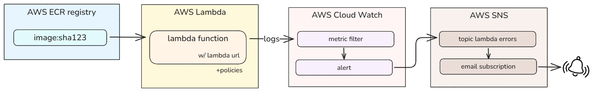
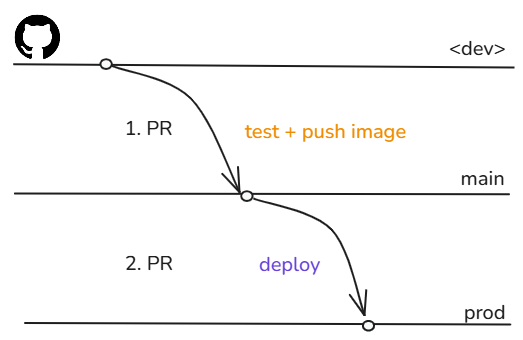

# basic-service-template
Template repository to deploy a web application as service with a DNS with a CI/CD pipeline 


## 0. S3 setup

In the same AWS project : <br>
1. Create a bucket 
2. Create a folder named terraform
3. Create 3 subfolders prod , staging , test
This is done to save the terraform state

## 1. ECR setup
In the same AWS project : <br>
1. Go to ECR
2. Create necessary registry 

## 2. Repository setup

As basics , the following repository's variables & secrets needs to be set up : 
- Variables
```
AWS_PROJECT_ID=<aws project id>
AWS_REGION=<aws project region>
TF_VAR_<app_name>_image_registry=<the image application registry>
```
- Secrets
```
# AWS credentials
TF_VAR_alerting_email=<email recipient to receive the error events>
AWS_SECRET_KEY_ID=
AWS_SECRET_KEY=
GH_PAT_WRITE_VARIABLES=<a github PAT with write variable permissions>
```

NOTES : For AWS authentication,  Workload identity provider was not used as a bug occurred when pushing image to repository but I did not spend hours trying to fix it so it can be certainly be fixed

# 3. Deploy an application
1. Create a branch for your application
2. Create a folder inside the 'apps' folder
3. Create a github actions .yaml file like the one done as example
4. Write your code
5. Make a pull request from * to main to test and push your image
6. Make a second pull request from main to prod
Your application is deployed 

## Docs 

### Resource Map used for the example



### Git Flow


